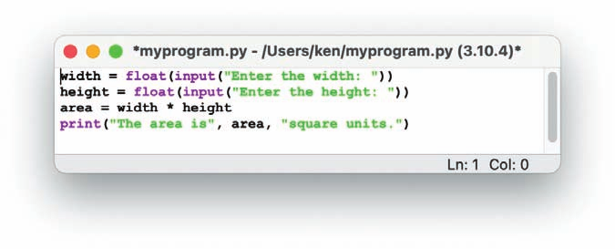

## Instructions

In **rectangle.py**, enter the program from _Figure 1-7_ that computes the area of a rectangle. Run it and correct any errors that occur. Test the program with different inputs. (LO: 1.4)

## Your Tasks
