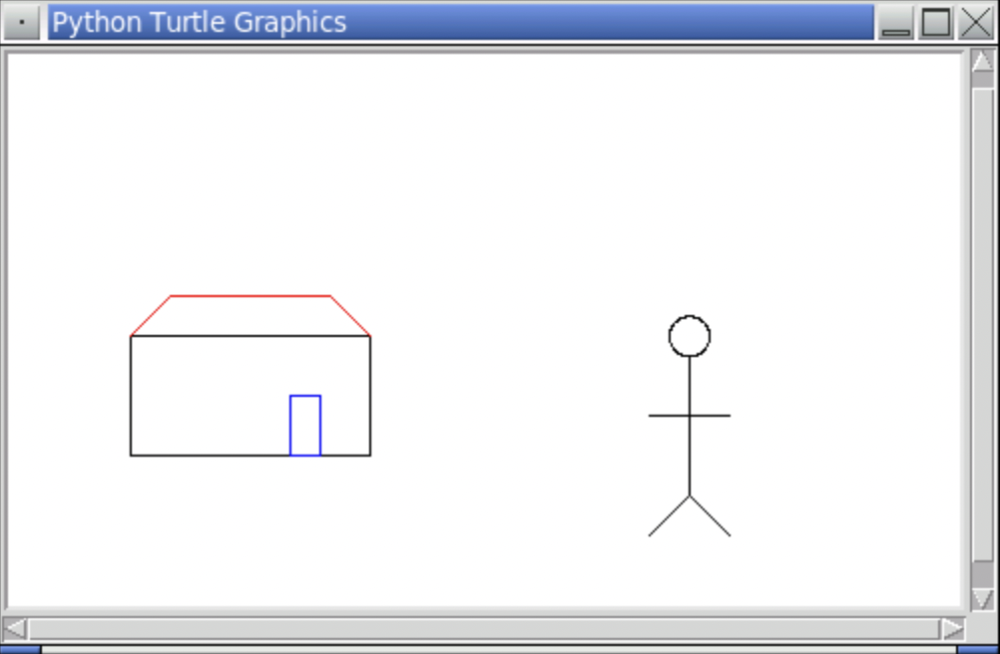

<!-- manual -->

## Instructions

Geometric shapes can be modeled as classes. Develop classes for line segments,
circles, and rectangles in the **shapes.py** file. Each shape object should contain a `Turtle` object and a color that allow the shape to be drawn in a Turtle graphics window (see Chapter 8 for details).

Factor the code for these features (instance variables and methods)
into an abstract `Shape` class. The `Circle`, `Rectangle`, and `Line` classes are all subclasses of `Shape`. These subclasses include the other information about the specific types of shapes, such as a radius or a corner point and a `draw` method.

Write a script called **testshapes.py** that uses several instances of the different shape classes to draw a house and a stick figure. (LO: 10.1, 10.2, 10.4)

Set the starting position (x-axis, y-axis) of the main window to **(0,0)** by using the **turtle.setup()** function.

> Make sure to use the **turtle.done()** function as the last statement in your turtle graphics program.

An example of the program is shown below:

    

## Your Tasks
