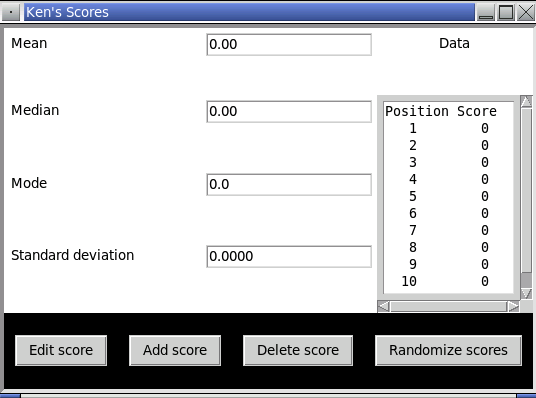

<!-- manual -->

## Instructions

This exercise assumes that you have completed _Programming Exercise 1_. Complete the implementation of the `StudentView` class from the _Analyzing Student Test Scores_ case study. (LO: 11.1)

An example of the program is shown below:

<!--
{
    "CopyExercise": {
        "name": "student.py",
        "copyTarget": "/chapter11/ex01/student/student.py",
        "pasteTarget": "/student.py"
    }
}
-->

## Your Tasks
