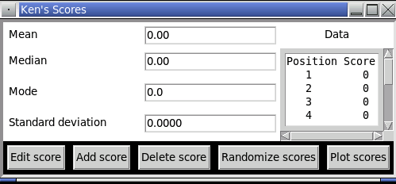
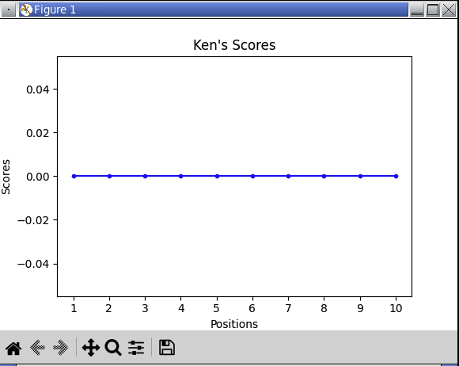

<!-- manual -->

## Instructions

Add a command button named "Plot scores" to the user interface for the _Analyzing Student Test Scores_ case study. When the user selects this button, the program displays a line plot of the student’s test scores. You should plot the positions along the x-axis and the scores along the y-axis. (LO: 11.2)

An example of the program is shown below:

<!--
{
    "CopyExercise": {
        "name": "11.2 program files",
        "copyTarget": "/chapter11/ex02/student/*",
        "pasteTarget": "/"
    }
}
-->

## Your Tasks
