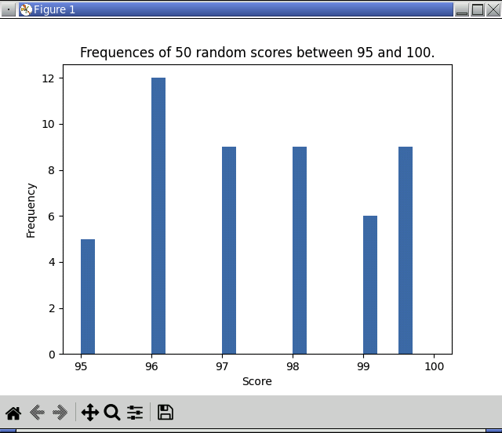

<!-- manual -->

## Instructions

Write a program in a file named **histogram.py** that displays the histogram depicted in Figure 11-7. (LO: 11.2)

An example of the program is shown below:

    
    

Figure 11-7. Histogram

## Your Tasks
