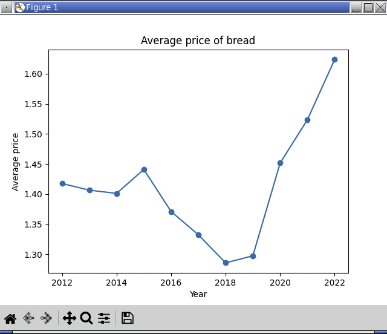

<!-- manual -->

## Instructions

Visit the website of the U.S. Bureau of Labor Statistics at https://www.bls.gov/data/home.htm and download the data for the average price of bread, as shown earlier in this chapter (there will be data for more recent years added since these words were written). Write a program in a file named **breadprice.py** that loads the data set and cleans it as you did earlier in this chapter. Then include code to display a line plot of the average price for each year in the table. (LO: 11.1, 11.2, 11.3)

An example of the program is shown below:

<p align="center">
    
</p>

```
    Year    Jan    Feb    Mar    Apr    May    Jun    Jul    Aug    Sep    Oct    Nov    Dec
0   2012  1.423  1.442  1.395  1.426  1.412  1.403  1.427  1.407  1.401  1.422  1.418  1.436
1   2013  1.422  1.411  1.412  1.409  1.401  1.439  1.434  1.408  1.419  1.358  1.382  1.385
2   2014  1.365  1.388  1.359  1.388  1.401  1.400  1.413  1.396  1.405  1.414  1.420  1.466
3   2015  1.479  1.435  1.440  1.454  1.463  1.467  1.447  1.420  1.432  1.418  1.409  1.428
4   2016  1.425  1.407  1.416  1.406  1.382  1.333  1.349  1.341  1.329  1.343  1.362  1.362
5   2017  1.351  1.358  1.329  1.328  1.327  1.335  1.327  1.348  1.349  1.328  1.295  1.316
6   2018  1.281  1.265  1.309  1.281  1.293  1.279  1.293  1.302  1.288  1.277  1.274  1.290
7   2019  1.274  1.282  1.261  1.285  1.289  1.280  1.281  1.275  1.296  1.325  1.361  1.363
8   2020  1.351  1.375  1.374  1.406  1.412  1.474  1.485  1.495  1.492  1.503  1.515  1.538
9   2021  1.546  1.537  1.526  1.510  1.511  1.510  1.491  1.467  1.580  1.526  1.547  1.532
10  2022  1.555  1.578  1.607  1.612  1.606  1.691  1.715    NaN    NaN    NaN    NaN    NaN
      Jan    Feb    Mar    Apr    May    Jun    Jul       Aug       Sep       Oct       Nov       Dec
0   1.423  1.442  1.395  1.426  1.412  1.403  1.427  1.407000  1.401000  1.422000  1.418000  1.436000
1   1.422  1.411  1.412  1.409  1.401  1.439  1.434  1.408000  1.419000  1.358000  1.382000  1.385000
2   1.365  1.388  1.359  1.388  1.401  1.400  1.413  1.396000  1.405000  1.414000  1.420000  1.466000
3   1.479  1.435  1.440  1.454  1.463  1.467  1.447  1.420000  1.432000  1.418000  1.409000  1.428000
4   1.425  1.407  1.416  1.406  1.382  1.333  1.349  1.341000  1.329000  1.343000  1.362000  1.362000
5   1.351  1.358  1.329  1.328  1.327  1.335  1.327  1.348000  1.349000  1.328000  1.295000  1.316000
6   1.281  1.265  1.309  1.281  1.293  1.279  1.293  1.302000  1.288000  1.277000  1.274000  1.290000
7   1.274  1.282  1.261  1.285  1.289  1.280  1.281  1.275000  1.296000  1.325000  1.361000  1.363000
8   1.351  1.375  1.374  1.406  1.412  1.474  1.485  1.495000  1.492000  1.503000  1.515000  1.538000
9   1.546  1.537  1.526  1.510  1.511  1.510  1.491  1.467000  1.580000  1.526000  1.547000  1.532000
10  1.555  1.578  1.607  1.612  1.606  1.691  1.715  1.623429  1.623429  1.623429  1.623429  1.623429
```

## Your Tasks
