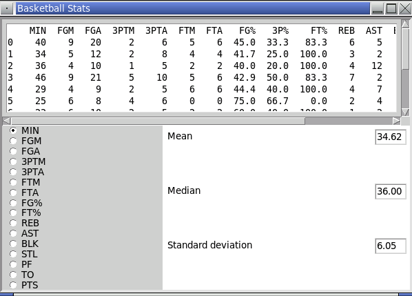

<!-- manual -->

## Instructions

This exercise assumes that you have completed _Programming Exercise 6_. Add radio buttons for the remaining columns of data to the program window of the _Analyzing Basketball Statistics_ case study. (LO: 11.3)

An example of the program is shown below:

    

<!--
{
    "CopyExercise": {
        "name": "11.6 program files",
        "copyTarget": "/chapter11/ex06/student/*",
        "pasteTarget": "/"
    }
}
-->

## Your Tasks
