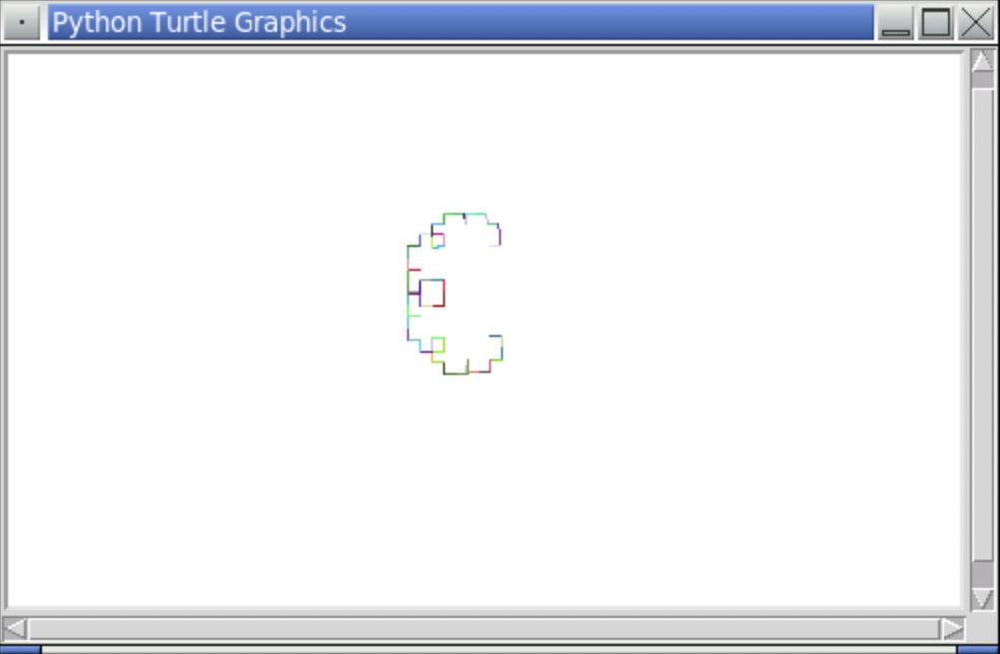

<!-- manual -->

## Instructions

Modify this chapter’s case study program (the c-curve, in the file **ccurve.py**) so that it draws the line segments using random colors. (LO: 8.1)

An example of the program is shown below:

    

## Your Tasks
