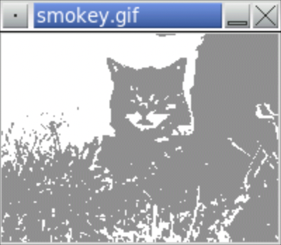

<!-- manual -->

## Instructions

Define and test a function named `posterize` (in the file **posterize.py**). This function expects an image and a tuple of RGB values as arguments. The function modifies the image like the `blackAndWhite` function, but it uses the given RGB values instead of black. (LO: 8.2)

An example of the program is shown below:

<p align="center">
    
</p>

```
Enter the image file name: smokey.gif
Enter an integer [0..255] for red: 144
Enter an integer [0..255] for green: 144
Enter an integer [0..255] for blue: 144
```

## Your Tasks
