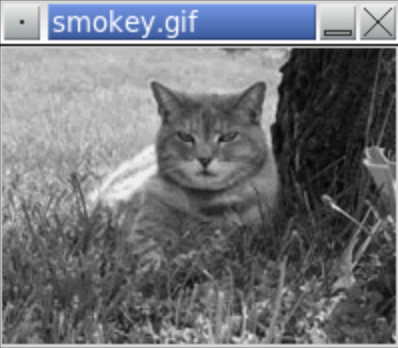

<!-- manual -->

## Instructions

Define a second version of the `grayscale` function (in the file **grayscale.py**) that uses the allegedly crude method of simply averaging each RGB value. Test the function by comparing its results with those of the other version discussed in this chapter. (LO: 8.2)

An example of the program is shown below:

<p align="center">
    
</p>

```
Enter the image file name: smokey.gif
```

## Your Tasks
