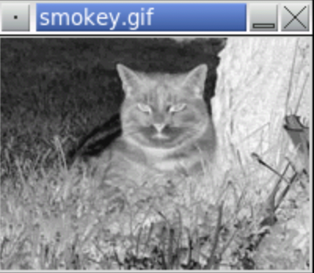

<!-- manual -->

## Instructions

Inverting an image makes it look like a photographic negative. Define and test a function named `invert` (in the file **invert.py**). This function expects an image as an argument and resets each RGB component to 255 minus that component. Be sure to test the function with images that have been converted to grayscale and black and white as well as color images. (LO: 8.2)

An example of the program is shown below:

<p align="center">
    
</p>

```
Enter the image file name: smokey.gif
```

## Your Tasks
