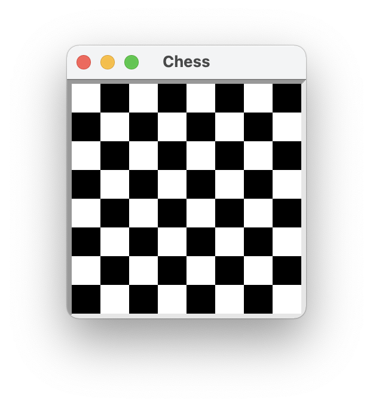
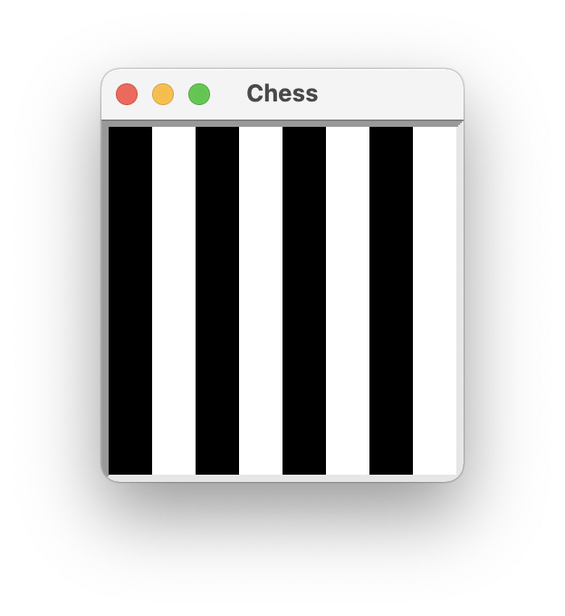

<!-- manual -->

## Instructions

Jack is responsible for designing and laying out a GUI for the game of chess. A chessboard is an 8 by 8 grid of squares of alternating colors, where no two adjacent squares have the same color. A prototype of the desired interface is shown first in **Figure 9-23**, along with the result of Jack’s design effort thus far after.

<p align="center">
    
    
</p>

<sup>_Figure 9-23_</sup>

Obviously, there is an error somewhere in Jack’s code. Determine the error and correct it. Here is Jack’s code (in the file **chessboard.py**):

```python
from breezypythongui import EasyFrame

class Chessboard(EasyFrame):

    def __init__(self):
        """Sets up the window and the panels."""
        EasyFrame.__init__(self, title = "Chess",
                           width = 200, height = 200)
        color = "white"
        for row in range(8):
            for column in range(8):
                if color == "black":
                    color = "white"
                else:
                    color = "black"
                self.addPanel(row = row, column = column,
                              background = color)

def main():
    """Instantiate and pop up the window."""
    Chessboard().mainloop()

if __name__ == "__main__":
    main()

```

Determine why this error occurs and correct it. Jack reminds Jill that the GIF format supports at most 256 unique colors.

## Your Tasks
