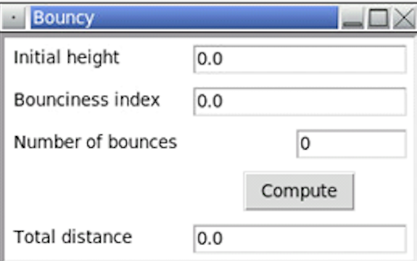
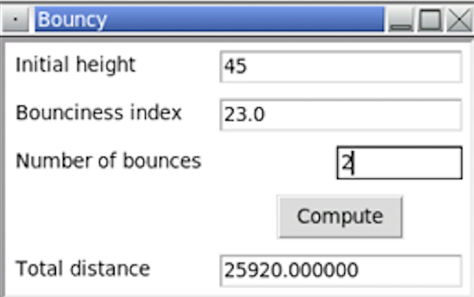

<!-- manual -->

## Instructions

Write a GUI-based program in the file **bouncywithgui.py** that implements the bouncy program discussed in _Programming Exercise 4_ of _Chapter 3_. (LO: 9.2, 9.3, 9.4, 9.5)

An example of the program is shown below:

    
    

## Your Tasks
