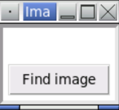
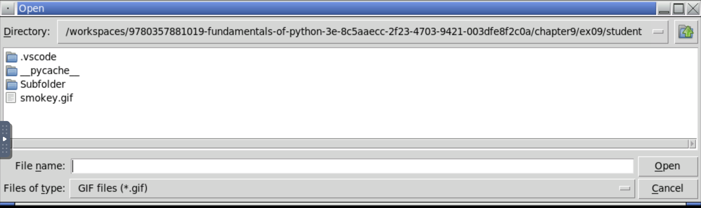
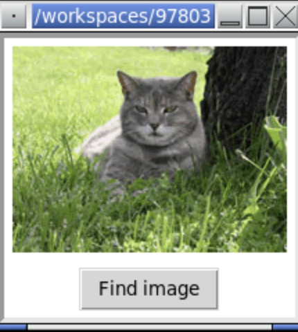

<!-- manual -->

## Instructions

Write a GUI-based program in the file **imagebrowser.py** that implements an image browser for your computer’s file system. The look, feel, and program logic should be like those of the simple text file browser developed in this chapter. The file dialog should filter for GIF image files and create and open a PhotoImage when a file is accessed. (LO: 9.2, 9.3, 9.4, 9.6, 9.7)

An example of the initial window is shown below:

    

An example of the file dialog is shown below:

    

An example of the image display window is shown below:

    

## Your Tasks
